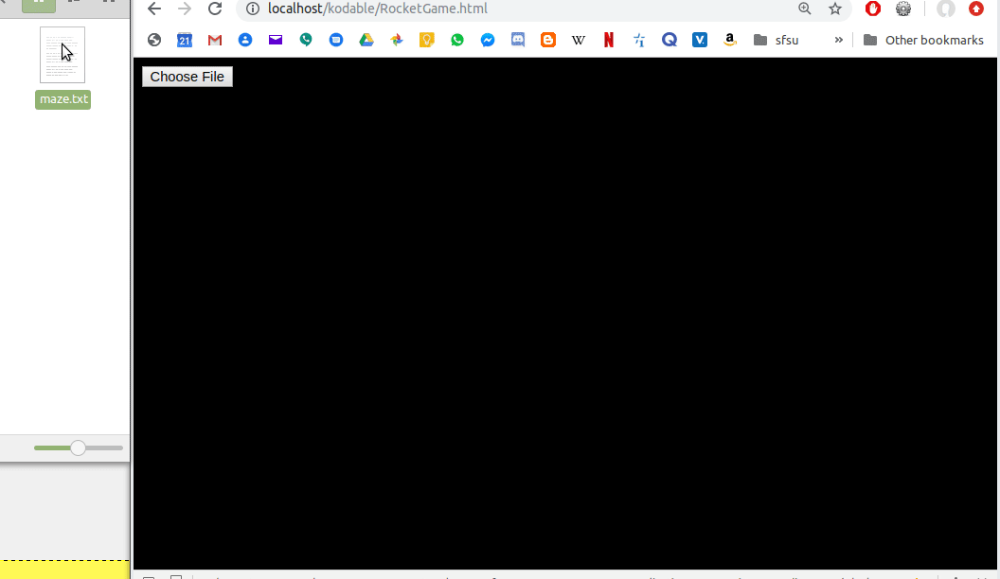

# Rocket Game
This program is a demonstration of the cocos-2d-js framework.  
You can upload a maze drawn using ASCII characters. The game will parse the file, automatically generate a solution and then graphically display a rocket making its way to the end of the maze.  
This game should work with any maze drawn using the same ASCII characters in the same format.
## Gif Demo  
